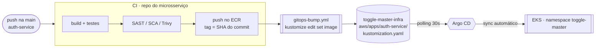

# Entrega Contínua (CD) & GitOps — ToggleMaster

Parte de **CD** do Tech Challenge Fase 3: pasta de GitOps, Argo CD no EKS,
atualização automática da tag da imagem pelo pipeline e sincronização automática
do cluster.

## 1. Mapa dos requisitos

| Requisito do enunciado | Onde está |
|---|---|
| Pasta de GitOps só com manifestos | `aws/platform/` + `aws/apps/<serviço>/` |
| Argo CD instalado no EKS | `terraform/platform` (`helm_release.argocd`) |
| CI atualiza a tag da imagem | `.github/workflows/gitops-bump.yml` |
| Argo CD monitora e sincroniza sozinho | `automated`, `prune`, `selfHeal` |
| Argo CD gerenciando os 5 microsserviços | 5 Applications independentes |

## 2. Como o fluxo funciona



Três pontos caracterizam GitOps aqui:

1. **Nenhum pipeline tem credencial de cluster.** O CI não roda `kubectl`; ele só
   faz commit num repositório Git. O `GITOPS_TOKEN` dá escrita em **um
   repositório**, não no EKS.
2. **O Git é a fonte da verdade.** `selfHeal: true` desfaz qualquer alteração
   manual no cluster — o problema do enunciado (*"desenvolvedores rodando kubectl
   apply das máquinas locais"*) deixa de existir na prática.
3. **A tag é imutável.** O SHA do commit em vez de `latest`, então o que está no
   Git descreve exatamente o binário em execução e o rollback é `git revert`.

O Argo CD não reage só a commit: ele compara Git e cluster a cada 30s e corrige a
divergência, tenha ela vindo de qual lado for.

## 3. Por que um kustomization por serviço

Cada Application do Argo CD aponta para **um diretório**. Um bloco `images:`
único na raiz não pode ser dividido entre 5 Applications, então cada serviço tem
o seu:

```yaml
images:
- name: auth-service
  newName: <registry>/togglemaster/auth-service
  newTag: a1b2c3d4e5f6...      # <- linha que o CI reescreve
```

O Deployment continua referenciando `auth-service:latest`; o kustomize substitui
registry e tag. É o mesmo efeito de editar o `deployment.yaml` à mão, mas com diff
de duas linhas por deploy e sem risco de um `sed` pegar a string errada.

A lista segue o estilo canônico do kustomize (itens sem indentação): com a lista
indentada, `kustomize edit` reserializa o arquivo inteiro e o diff deixa de ser de
duas linhas.

A tag inicial `v0.0.0-bootstrap` **não existe no ECR**, de propósito. Antes do
primeiro run do CI os pods ficam em `ImagePullBackOff`, um estado óbvio. Uma tag
`latest` serviria uma imagem velha em silêncio.

`aws/kustomization.yaml` continua agregando tudo, para depurar sem o Argo CD:

```bash
kubectl apply -k aws
```

## 4. Bootstrap

O Argo CD sobe junto com o resto da plataforma — não há passo manual:

```bash
cd terraform/platform
terraform apply
```

O `helm_release.argocd` instala o chart e, via `extraObjects`, cria o Application
raiz. A partir daí o Argo CD monta sozinho as 6 Applications — a `platform` e os 5
serviços — na ordem das sync waves. Para desligar num ambiente específico,
`install_argocd = false`.

```bash
kubectl -n argocd get secret argocd-initial-admin-secret -o jsonpath='{.data.password}' | base64 -d
kubectl -n argocd port-forward svc/argocd-server 8080:80
```

Os Jobs de init de banco são hooks `PostSync` com `BeforeHookCreation`. Sem isso o
segundo sync falha, porque `Job` é imutável no Kubernetes.

## 5. Contrato com o pipeline de CI

O CI está centralizado em `toggle-master-ci`, então o job entra nos 2 workflows
reutilizáveis, e não nos 5 repositórios de serviço:

```yaml
  gitops:
    if: github.ref == 'refs/heads/main' && github.event_name == 'push'
    needs: [docker-build-push]
    uses: FIAP-Teach-Challenge-2/toggle-master-infra/.github/workflows/gitops-bump.yml@main
    with:
      service: ${{ inputs.service-name }}
      image: ${{ needs.docker-build-push.outputs.image }}   # registry/repo, SEM a tag
      tag: ${{ github.sha }}
    secrets:
      GITOPS_TOKEN: ${{ secrets.GITOPS_TOKEN }}
```

O job que faz o push precisa expor a imagem como `outputs:`, porque `steps.*` não
atravessa fronteira de job. Como os `ci.yml` usam `secrets: inherit`, um secret de
organização chega até aqui sem alterar os 5 repositórios.

`GITOPS_TOKEN` é um PAT fine-grained com **Contents: Read and write** neste
repositório, configurado como secret da organização e liberado para os 5 repos de
serviço. Ele não dá acesso à AWS nem ao cluster.

O workflow valida as entradas (recusa `latest` e serviço fora da lista), roda
`kustomize build` antes de commitar, e tem retry com rebase — se os 5 pipelines
terminarem juntos, os 5 commits entram sem conflito. O bloco `concurrency` **não**
serializa os 5 repositórios entre si: grupos de concorrência são escopados por
repositório e, num reusable workflow, o run pertence ao chamador.
